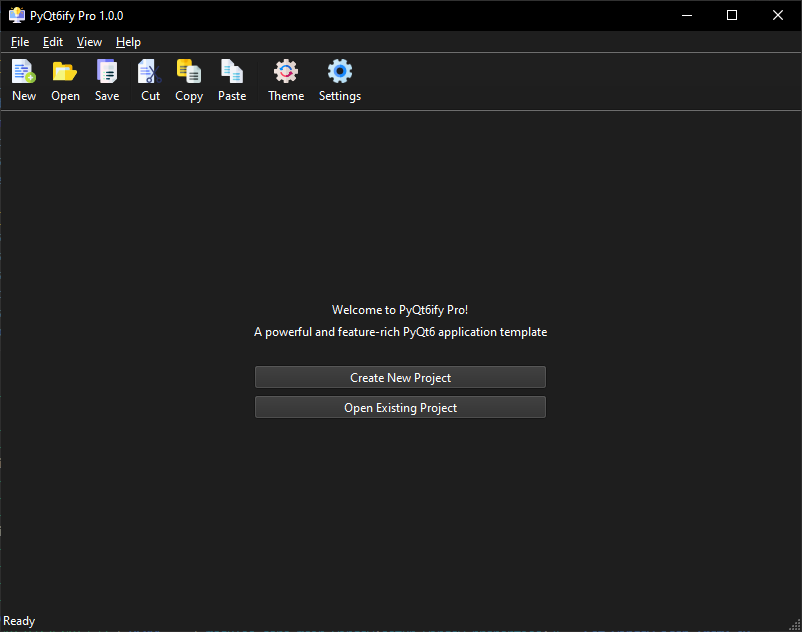

# PyQt6ify Pro

[](https://opensource.org/licenses/MIT)
[](https://www.python.org/downloads/)
[](https://www.riverbankcomputing.com/software/pyqt/)
[](https://github.com/EliranCV/PyQt6ify-Pro)
[](https://github.com/psf/black)
[](https://github.com/elirancv/PyQt6ify-Pro/actions)
[](https://github.com/Delgan/loguru)
[](https://github.com/PyCQA/pylint)
[](https://github.com/elirancv/PyQt6ify-Pro/issues)
[](https://github.com/elirancv/PyQt6ify-Pro/pulls)
[](https://github.com/elirancv/PyQt6ify-Pro/stargazers)
[](https://github.com/elirancv/PyQt6ify-Pro/blob/main/LICENSE.md)

A professional Qt6-based desktop application framework that provides a robust foundation for building modern, feature-rich GUI applications in Python. This framework emphasizes modularity, extensibility, and modern UI/UX practices.

<div align="center">
  
</div>

## 🌟 Key Features

### 🎨 Modern UI Framework
- **Dynamic Theme System**
  - Light/Dark mode with runtime switching
  - Custom theme creation and import
  - Windows 11 dark mode integration
  - Theme persistence across sessions

### 🏗️ Architecture
- **Modular Design**
  - Component-based architecture
  - Plugin system for extensions
  - Clean separation of concerns
  - Event-driven patterns

### ⚙️ Core Features
- **Configuration Management**
  - Multi-tier configuration system
  - User settings persistence
  - Module enablement control
  - Runtime configuration updates

- **Error Handling & Logging**
  - Comprehensive exception management
  - Rotating log files
  - Detailed debug logging
  - User-friendly error dialogs

- **Database Integration**
  - SQLite database with ORM
  - Automated schema management
  - Transaction support
  - Data validation

### 🖥️ UI Components
- **Modern Menu System**
  - Icon-based menu items
  - Keyboard shortcuts
  - Status tips
  - Customizable layout

- **Toolbar & Status Bar**
  - Configurable toolbar actions
  - Live status updates
  - Progress indicators
  - System notifications

## 🚀 Quick Start

### Prerequisites
- Python 3.8+
- Git
- pip

### One-Line Installation
```bash
pip install git+https://github.com/elirancv/PyQt6ify-Pro.git
```

### Manual Installation
1. Clone the repository:
   ```bash
   git clone https://github.com/elirancv/PyQt6ify-Pro.git
   cd PyQt6ify-Pro
   ```

2. Create and activate a virtual environment:
   ```bash
   python -m venv venv
   
   # Windows
   venv\Scripts\activate
   
   # Unix/MacOS
   source venv/bin/activate
   ```

3. Install dependencies:
   ```bash
   pip install -r requirements.txt
   ```

4. Run the application:
   ```bash
   python main.py
   ```

## 🏗️ Project Structure
```
PyQt6ify-Pro/
├── modules/               # Core application modules
│   ├── about/            # About dialog
│   ├── config/           # Configuration system
│   ├── core/             # Core application logic
│   ├── dashboard/        # Main UI dashboard
│   ├── database/         # Database operations
│   ├── error_handling/   # Error management
│   ├── menu/             # Menu system
│   ├── resources/        # Resource management
│   ├── status_bar/       # Status bar
│   ├── themes/           # Theme engine
│   └── toolbar/          # Toolbar system
├── database/             # SQLite database
├── docs/                 # Documentation
├── extensions/           # Extension modules
├── logs/                 # Application logs
├── resources/            # Application resources
│   └── icons/           # UI icons
├── tests/                # Test suite
│   ├── about/           # About module tests
│   ├── config/          # Configuration tests
│   ├── core/            # Core module tests
│   └── ...              # Other module tests
├── main.py              # Application entry
├── requirements.txt     # Dependencies
└── LICENSE.md           # License
```

## ⚙️ Configuration

### System Configuration
Located in `modules/config/system_config.py`:
```python
{
    'Application': {
        'Name': 'PyQt6ify Pro Lite',
        'Version': '1.0.0.0',
        'Debug': 'False'
    },
    'Modules': {
        'logging': 'True',
        'database': 'True',
        'menu': 'True',
        'toolbar': 'True',
        'status_bar': 'True'
    }
}
```

### User Settings
Stored in `config/user_settings.ini`:
```ini
[Window]
theme = dark
start_maximized = true
screen_width = 1024
screen_height = 768

[Features]
auto_save = true
```

## 🧪 Testing

Run the test suite:
```bash
# Run all tests with coverage
python -m pytest tests/ --cov=modules

# Run specific module tests
pytest tests/config/
pytest tests/themes/
```

## 🎨 Theme System

### Built-in Themes
- Light Theme (Default)
- Dark Theme
- System Theme (Windows 11)

### Custom Themes
Create custom themes using JSON:
```json
{
  "theme_name": {
    "window": {
      "background": "#FFFFFF",
      "foreground": "#000000"
    },
    "accent": "#0078D4"
  }
}
```

## 📚 Documentation

Comprehensive documentation is available in the `docs/` directory:
- API Reference
- Component Guide
- Theme Customization
- Extension Development

## 🤝 Contributing

Please read our [Contributing Guidelines](CONTRIBUTING.md) before making a pull request.

<details>
<summary>Click to expand contribution workflow</summary>

1. Fork the repository
2. Create your feature branch
   ```bash
   git checkout -b feature/amazing-feature
   ```
3. Commit your changes
   ```bash
   git commit -m 'Add amazing feature'
   ```
4. Push to the branch
   ```bash
   git push origin feature/amazing-feature
   ```
5. Open a Pull Request

</details>

## 📄 License

This project is licensed under the MIT License - see [LICENSE.md](LICENSE.md) for details.

## 🙏 Acknowledgments

- [PyQt6](https://www.riverbankcomputing.com/software/pyqt/) - The Qt framework for Python
- [Riverbank Computing](https://www.riverbankcomputing.com/) - Developers of PyQt

## 📫 Support & Links

<div align="center">

[](https://github.com/elirancv/PyQt6ify-Pro/issues)
[](https://github.com/elirancv/PyQt6ify-Pro/pulls)
[](https://github.com/elirancv/PyQt6ify-Pro/stargazers)
[](https://github.com/elirancv/PyQt6ify-Pro/blob/main/LICENSE.md)

</div>

- 📘 [Documentation](https://github.com/elirancv/PyQt6ify-Pro/wiki)
- 🐛 [Issue Tracker](https://github.com/elirancv/PyQt6ify-Pro/issues)
- 💡 [Feature Requests](https://github.com/elirancv/PyQt6ify-Pro/issues/new?labels=enhancement)
- 📋 [Project Board](https://github.com/elirancv/PyQt6ify-Pro/projects)